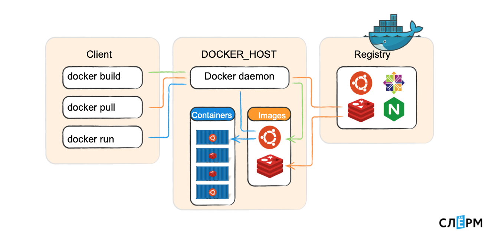

## Вопросы
### Что такое docker и какие инструменты linux лежат в основе? Для чего он используется?

Docker базируется на технологиях **namespaces**, **cgroups**, **capabilities**, **overlay**
**namespaces** - обеспечивает изоляцию. Используется для изоляции. Например, можно айдишники процессов разместить в разных контейнерах.
**cgroup** - штука, которая позволяет управлять группой процессов, и управлять их ресурсами.
**capabilites** - штука, которая позволяет дать некоторые рут привелегии процессам или исполняемым файлам. Например, изменить UID процесса на 0, или дать возможность монтировать файловые системы.
**overlay (overlayFS, overlay2-драйвер)** - файловая система, которая умеет работать "слоями". Не сохранять каждый раз новые файлы, а наслаивать один слой на другой, тем самым экономя место на диске и время создания контейнера.

А вот докер - это уже штука, которая всеми этими технологиями рулит. Да ещё и удобным для нас образом.

Компоненты докера:
1. Docker Daemon — то самое Container Engine; запускает контейнеры.
2. Docker CII — утилита по управлению Docker.
3. Dockerfile — инструкция по тому, как собирать образ.
4. Image — образ, из которого раскатывается контейнер.
5. Container.
6. Docker registry — хранилище образов.

На Docker_host работает Docker daemon, запускает контейнеры. Есть Client, который передаёт команды: собери образ, скачай образ, запусти контейнер. Docker daemon ходит в registry и выполняет их. Docker-клиент может обращаться и локально (к юникс-сокету), и по TCP с удалённого хоста.

Docker daemon (демон) — это серверная часть, она работает на хост-машине: скачивает образы и запускает из них контейнеры, создаёт сеть между контейнерами, собирает логи. Когда мы говорим «создай образ», этим тоже занимается демон.

Docker CLI — клиентская часть Docker, консольная утилита для работы с демоном. Повторю, она может работать не только локально, но и по сети.

### Что такое контейнеры, образы? В чём заключаются концепции их использования?

**Образ** - шаблон приложения, который содержит слои файловой системы в режиме "только-чтение".
**Контейнер** - запущенный образ приложения, который кроме нижних слоев в режиме "только чтение" содержит верхний слой в режиме "чтение-запись".
Контейнер - это уже развернутое и запущенное приложение. Однажды запущенный контейнер сохранён в библиотеке, его можно останавливать, менять настройки, перезапускать, но до удаления контейнера это некоторая постоянная сущность со своим id. Продолжая аналогию с установкой ПО, контейнер можно сравнить с уже установленной и работающей программой на ПК.
Образ - Это неизменяемый образ, из которого разворачивается контейнер. Его можно рассматривать как набор файлов, необходимых для запуска и работы приложения на другом хосте. Можно привести аналогию из мира установки ПО: образ — это компакт-диск, с которого устанавливается программа.

### В каком виде хранятся образы? Для чего используются слои? Что представляет собой overlayfs?

**Образы(images)** - это логическая группировка слоев плюс метаданные о том, что делать при создании контейнера и как собирать слои. Часть этих метаданных заключается в том, что каждый слой знает ID своего родителя.
Итак, что входит в слой? Файлы (и каталоги), которые вы добавили в родительский файл. Существуют также специальные файлы ("whiteout"), которые указывают на то, что что-то было удалено из родительского файла.
Docker-image — шаблон только для чтения (read-only) с набором некоторых инструкций, предназначенных для создания контейнера. Он состоит из слоев, которые Docker комбинирует в один образ при помощи вспомогательной файловой системы UnionFS. Так решается проблема нерационального использования дисковой памяти. Параметры образа определяются в Docker-file.

### Что такое docker commit

Это утилита, с помощью которой можно сощздать новый образ на основе контейнера либо перезаписать текущий образ

Может быть полезно когда ты что ты изменил какой то файл в docker контейнере, и тебе нужно сохранить этот новый рабочий обновленный образ.

### Что такое слои в докере?

По сути, слой или _слой образа_ это изменение образа или **промежуточного образа**. Каждая команда, указанная (`FROM`, `RUN`, `COPY` и т.д.) в вашем Dockerfile вызывает предыдущий образ изменения, создавая тем самым новый слой. Вы можете думать об этом как о внесении изменений при использовании git: вы добавляете изменение файла, затем еще одно, затем добавляя ещё одно, и слои накладываются один за другим.

Так же любые изменения, которые происходят в docker контейнере, автоматически записываются в новый слой.

### Что такое эфемерные контейнеры?

[Эфемерные контейнеры](https://kubernetes.io/docs/concepts/workloads/pods/ephemeral-containers/) стали бета-функцией в Kubernetes v1.23 и теперь включены по умолчанию.
Эфемерные контейнеры предназначены для транзитных задач, когда вам нужно временно [подключить дополнительный контейнер к существующему поду](https://kubernetes.io/docs/tasks/debug/debug-application/debug-running-pod/#ephemeral-container). Это идеально подходит для отладочных операций, когда вы хотите проверить поды, не затрагивая живые экземпляры контейнеров.

### Почему latest образы использовать нежелательно?

Сложно в отладке как минимум. Не разобраться какая именно версия закосячила. А так прод работает на определенной версии, пусть дальше на ней и работает.
Помимо этого это небезопасно. Никто не знает что выкатит разработчик в новой версии. Может не быть обратной совместимости в проекте.

### Что такое kata контейнер?

Это иная реализация контейнеров. Которые работают в оси под открытой инициативой. **Kata Containers** объединяют преимущества контейнеров и виртуальных машин (VM). Они обеспечивают более высокий уровень **изоляции и безопасности** для приложений, сохраняя при этом **лёгкость и скорость работы контейнеров**.  
Если обычные контейнеры используют стандартные механизмы контейнеризации Linux, у **Kata Containers** используются qemu, kvm.
Контейнер на стероидах. Больше для безопасности придумано.
