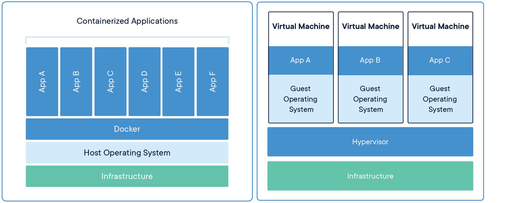

## Вопросы
### Для решения каких задач применяется docker-compose?

Docker Compose — это инструментальное средство, входящее в состав Docker. Оно предназначено для решения задач, связанных с развёртыванием проектов.
Вы передаёте файл с инструкциями для docker-compose, настроечными файлами, и докер на месте собирает из этого нужную вам комбинацию контейнеров, подтягивает образы нужных версий, пробрасывает в них волюмы с данными, поднимает между ними локальные сети и настраивает порты обмена.
### В чем разница между `docker stop` и `docker pause`?

В том, что они посылают разные сигналы
`docker pause` - SIGSTOP(19), что приостанавливает процессы в контейнере
`docker stop` - SIGTERM(15) и SIGKILL(9) использует к главному процессу контейнера

### Что такое контейнеризация? Чем она отличается от виртуализации?

Если говорить о виртуальных машинах, там они работают через **Виртуализацию**
И машины создаются с помощью гипервизора. И все аппаратные составляющие создаются через нее. И затем на нее накатываются операционные системы.
Соответственно, ресурсы машины будут уходить на поддержание работы запущенной операционной системы.
При контейнеризации аппаратные ресурсы выделяются с помощью ядра операционной системы, и изолируются пространством имен. Следовательно, они потребляют меньше ресурсов, и быстрее пересоздаются.
Плюсы:
- Меньше ресурсов потребляется
- Быстрый запуск

### Что такое виртуализация? Чем виртуализация отличается от эмуляции?

Виртуализация очень похожа на эмуляцию, но между ними есть важные различия. В частности, виртуализация обычно относится к использованию виртуальных машин. Виртуализация и эмуляция выполняют одно и то же, но делают это немного по-разному.
Оба предназначены для запуска программного обеспечения в изолированной среде. Виртуализация ориентирована на изоляцию, а эмуляция — на среду. Это означает, что эмуляторы имитируют большее количество оборудования, чем виртуальные машины.
Например, вы не можете запустить систему PlayStation на виртуальной машине. Но вы можете запустить эмулятор PlayStation в виртуальной среде Windows.
Эмуляция-это использование программного обеспечения для обеспечения другой среды выполнения или архитектуры. Например, у вас может быть эмулятор Android, запущенный на коробке Windows. Коробка Windows не имеет того же процессора, что и устройство Android, поэтому эмулятор фактически выполняет приложение Android с помощью программного обеспечения.
Виртуализация-это скорее создание виртуальных барьеров между несколькими виртуальными средами, работающими в одной и той же физической среде. Большая разница заключается в том, что виртуализированная среда представляет собой одну и ту же архитектуру. Виртуализированное приложение может предоставлять виртуализированные устройства, которые затем преобразуются в физические устройства, и узел виртуализации контролирует, какая виртуальная машина имеет доступ к каждому устройству или части устройства. Однако фактическое выполнение чаще всего все еще выполняется изначально, а не с помощью программного.
